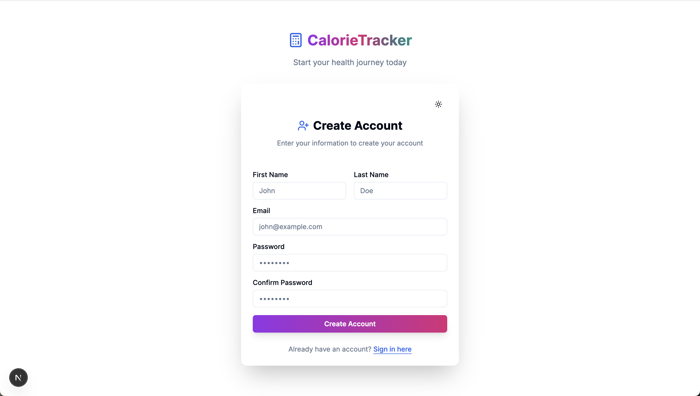
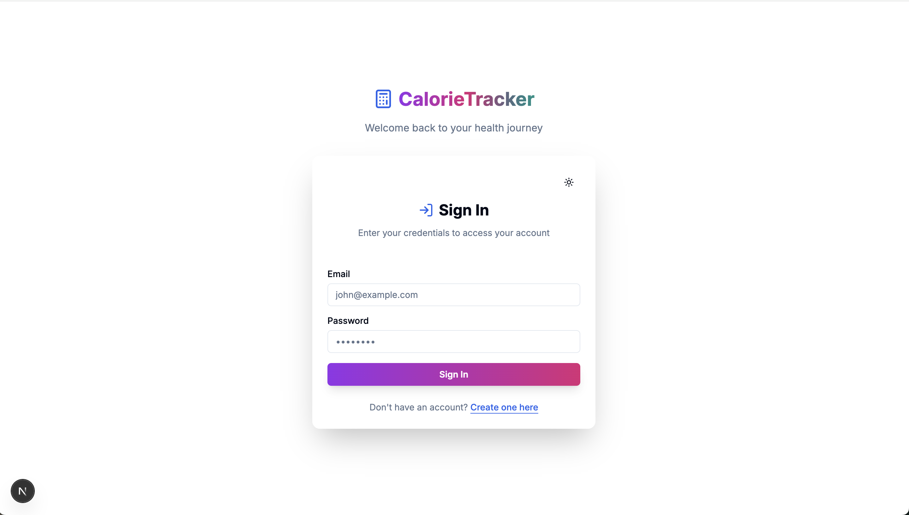
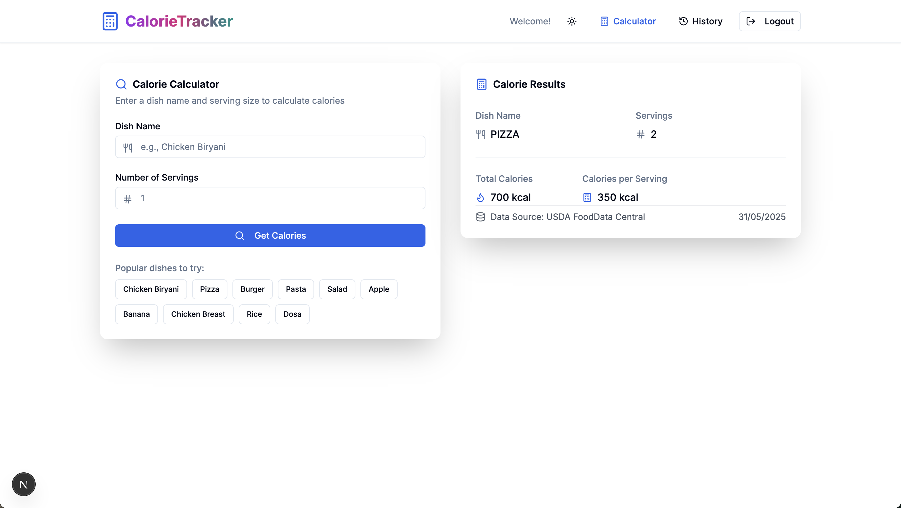

# CalorieTracker

A modern web application for tracking your daily nutrition and managing your health goals. Built with Next.js, TypeScript, and Tailwind CSS.





## Features

- 🔐 **Authentication**

  - Secure user registration and login
  - Protected routes with authentication guard
  - Persistent session management

- 🧮 **Calorie Calculator**

  - Search for any food item or dish
  - Calculate calories per serving
  - Support for multiple servings
  - Quick access to popular dishes

- 📊 **Nutritional Information**

  - Detailed calorie breakdown
  - Per serving and total calories
  - Data source attribution
  - Timestamp tracking

- 📱 **Responsive Design**

  - Mobile-first approach
  - Beautiful UI on all devices
  - Intuitive navigation
  - Dark/Light mode support

- 🔄 **Real-time Updates**
  - Instant calorie calculations
  - Live meal history updates
  - Smooth transitions and animations

## Tech Stack

- **Framework:** Next.js 15
- **Language:** TypeScript
- **Styling:** Tailwind CSS
- **UI Components:** shadcn/ui
- **State Management:** Zustand
- **Form Handling:** React Hook Form
- **Icons:** Lucide Icons
- **Theme:** next-themes
- **Notifications:** Sonner

## Prerequisites

Before you begin, ensure you have the following installed:

- Node.js (v18 or higher)
- npm or yarn
- Git

## Getting Started

1. **Clone the repository**

   ```bash
   git clone https://github.com/namanphagiwala/meal-calorie-frontend-naman.git
   cd calorie-counter-frontend
   ```

2. **Install dependencies**

   ```bash
   npm install
   # or
   yarn install
   ```

3. **Set up environment variables**
   Create a `.env.local` file in the root directory and add:

   ```env
   NEXT_PUBLIC_API_URL=your_api_url_here
   ```

4. **Run the development server**

   ```bash
   npm run dev
   # or
   yarn dev
   ```

5. **Open your browser**
   Visit `http://localhost:3000` to see the application.

## Available Scripts

- `npm run dev` - Start the development server
- `npm run build` - Build the application for production
- `npm run start` - Start the production server
- `npm run lint` - Run ESLint
- `npm test` - Run tests

## Project Structure

```
src/
├── app/                 # Next.js app directory
│   ├── dashboard/      # Dashboard pages
│   ├── login/         # Authentication pages
│   └── register/      # Registration pages
├── components/         # React components
│   ├── ui/           # UI components
│   └── ...           # Feature components
├── hooks/             # Custom React hooks
├── lib/               # Utility functions
├── store/             # State management
└── types/             # TypeScript types
```

## Acknowledgments

- [Next.js](https://nextjs.org/)
- [Tailwind CSS](https://tailwindcss.com/)
- [shadcn/ui](https://ui.shadcn.com/)
- [Lucide Icons](https://lucide.dev/)
